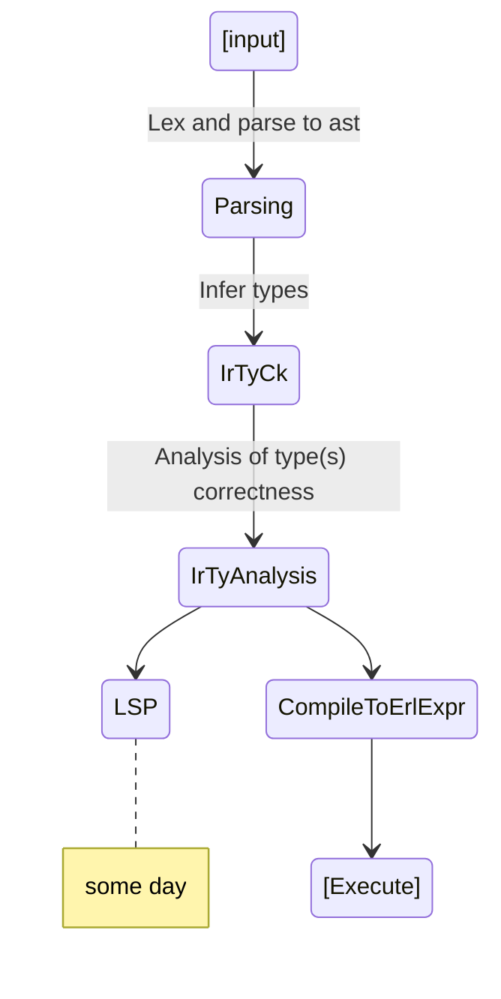

<a href="https://buymeacoffee.com/iesha" target="_blank">
</a>

# Gleam templating <small style="color:gray;">(Experimental)</small>

This is a typed gleam templating langauge. The langauge's main goal is the be _embeded gleam_ for templates.
secondly the langauge should map down the syntax and behavior to gleam as close as possible.

# Syntax and behaviorl compromises

Due to gleam, _as of now (v1.6)_, not having support for macros we compromise by utillising and evaling expression not as part of a runtime, but using erlang's macros behind the scenes. As for syntax again due to gleams lack of macros we must redefine gleams syntax as closely as possible.

# Types system

TODO

# Flow



# Type detection from gleam to templates

I have currently 2 ideas;

- Have a tags denote for the lsp where the data is. This however also leaves us with the responsibility to accuretly transform and again read types...
  ```gleam
  fn my_template() {
    drive(
      ///#@glt-lsp
      file: "path/to/temp.html",
      exclude: [],
      vars: dict.from_list([
        #("name", glt.String("iesha"))
      ])
      ///#@glt-lspend
    )
  }
  ```
- Have the template it's self denote the input and types. This we can implement and crash the template as well as easily load onto the lsp.

  ```txt
  
  ```

An issue to bring up with both of these is data loss. The first option is the one with prohaps the least however there are 2 approches with this;

1. parse the gleam section of the code.
   This would be a vary large task to support all of gleams syntax again and then take data from it.
   If gleam had a more robust system of inspection that redused syntax yet still provide all information this would be nice, but gleam does not.
   NOTE: Still if this was supported we'd only be inspecting a varints and not the customtype itself.
2. Await and diagnose the types compiled by erlang.

   ```erlang
   -type node_() :: {text, binary()} |
      {assert_expr, expr(), gleam@option:option(binary())} |
   ```

   Note that we have a goodish amount of info to work with, but lable are missing. Prohaps a simple fix for this would be if gleam added comments with the remaining information.

   ```erlang
     -type node_() :: {text, binary()} |
         % {expr, assert_message}
         {assert_expr, expr(), gleam@option:option(binary())} |
   ```

Back to the issue with the second; Loss of data. More specifically because the types system from the templates is independent of gleam's type system you'd need to recreate all type from gleam to gleam templates (not fun).

# Credits

- Nicd and their [parser implmintation](https://git.ahlcode.fi/nicd/glemplate/src/branch/trunk/src/glemplate/parser.gleam)!
- lpil for both gleam and his [gleam parser (made in gleam)](https://github.com/lpil/glance/tree/main)
